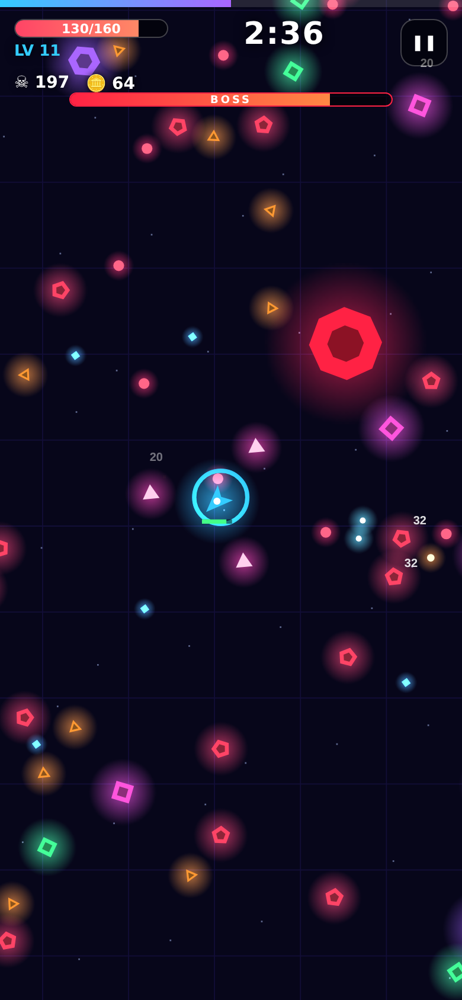

# 🛸 Neon Swarm — mobile survivor game

One-thumb, portrait, 2–6 minute runs. Drag to dodge, your ship auto-fires, level up, build a weapon combo, beat bosses, spend coins on permanent upgrades & heroes.
Tech: plain HTML5 Canvas + JS (no build step, no assets, 100% free) → PWA today, **Android APK/AAB via Capacitor** for Play Store + AdMob.



## Play / test
```bash
npm run serve        # then open http://localhost:8080 on your phone (same Wi-Fi) or Chrome DevTools mobile mode
```
Keyboard works too (WASD / arrows, P = pause).

## Why it can reach ₹1 lakh / month
Survivor-roguelites have the strongest retention + rewarded-ad fit in casual mobile.

| Hook | Where | Monetization |
|---|---|---|
| Revive after death | game-over | Rewarded ad **or** 5 💎 (IAP gems) |
| Double run coins | game-over | Rewarded ad |
| Reroll level-up cards | in-run | Rewarded ad |
| Lucky spin (1 free + 5 ad spins/day) | Rewards tab | Rewarded ad |
| Daily login ×2 | Rewards tab | Rewarded ad |
| 5× free coins/day | Rewards tab | Rewarded ad |
| Interstitial | between runs (after run 3, 90 s cooldown) | Interstitial (removed by IAP) |
| Banner | home screen | Banner |
| Remove Ads ₹149, Starter Pack ₹49, Gem packs ₹79–699 | Shop | IAP |

**Math:** ₹1 lakh ≈ $1,200/mo. At ~$8 blended rewarded eCPM in India-tier-mix ≈ $3–5, 8 rewarded + 2 interstitials per DAU/day ≈ $0.03–0.05 ARPDAU ⇒ **~25–40k DAU** (ads only), or ~15k DAU with a 2% IAP payer rate. Growth levers: short-video marketing (TikTok/Reels/Shorts gameplay clips), UA with ROAS > 1, Indian-language store listing.

## Where to plug in your accounts (later)
Everything lives in `js/config.js`:
1. `AD_PROVIDER`: `'mock'` → `'admob'` (done automatically in the native build), put real AdMob ids in `ADMOB`.
2. `Store.buy` in `js/ads.js` — replace the test purchase with Google Play Billing (RevenueCat / `cordova-plugin-purchase`) using the product ids in `Products`.
3. `Track.ev` — hook Firebase Analytics / GA4.
4. `privacy.html` — add your contact email, host it, paste the URL in Play Console.
5. `capacitor.config.json` → set your real `appId`.

## Get the APK (no Android Studio needed)
Push to GitHub → **Actions → Build Android APK** builds it for free. Download from the run's *Artifacts*, or from **Releases → apk-latest** and install on your phone (allow “install unknown apps”). This test APK uses fake ads/purchases.

## Build the Android app (release, real ads)
```bash
npm install
npm i @capacitor-community/admob
npm run android:add      # once
npm run android:sync     # copies web build to www/ (switches to AdMob) and syncs
npm run android:open     # Android Studio → Build → Generate Signed Bundle (AAB)
```
In `android/app/src/main/AndroidManifest.xml` add inside `<application>`: `<meta-data android:name="com.google.android.gms.ads.APPLICATION_ID" android:value="YOUR_ADMOB_APP_ID"/>` and set `android:screenOrientation="portrait"` on the activity.

## Game design cheat-sheet
- 5 weapons (Blaster, Orbit Blades, Chain Lightning, Homing Missiles, Nova Pulse), 7 passives, 5 levels each.
- Enemies: Grunt, Runner, Tank, Shooter, Splitter, Boss (every 90 s), swarm rings every 38 s.
- Meta: 7 permanent upgrades, 5 heroes, daily login, spin wheel, 3 daily missions.
- Synth audio (SFX + generative music) and haptics — no asset files, tiny download (~60 KB).

## Files
`index.html`, `css/style.css`, `js/{config,save,audio,ads,data,game,ui}.js`, `sw.js` + `manifest.json` (PWA), `.github/workflows/pages.yml` (free web hosting on GitHub Pages).
